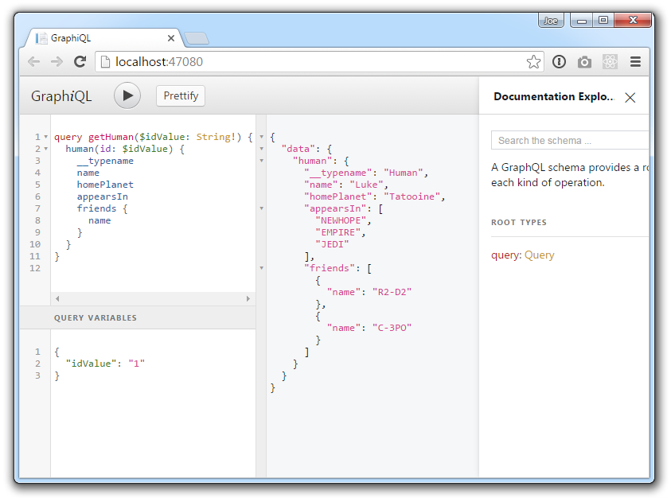

# GraphiQL

[GraphiQL](https://github.com/graphql/graphiql) is an interactive in-browser GraphQL IDE.
This is a fantastic developer tool to help you form queries and explore your Schema.



The easiest way to add GraphiQL into your ASP.NET Core app is to use the
[GraphQL.Server.Ui.GraphiQL](https://www.nuget.org/packages/GraphQL.Server.Ui.GraphiQL) package.
All you need to do after installing nuget is to append one extra line in your `Startup.cs`:

```csharp
public void Configure(IApplicationBuilder app, IHostingEnvironment env)
{
    app.UseGraphQLGraphiQL();
}
```

If you do not explicitly specify an endpoints through the optional `options` argument then
GraphiQL by default will run on `/ui/graphiql` endpoint and will send requests to `/graphql`
GraphQL API endpoint.

You may find GraphiQL example in [graphql-dotnet](https://github.com/graphql-dotnet/graphql-dotnet/blob/master/src/GraphQL.Harness/Startup.cs) repo.
[This ASP.NET Core sample project](https://github.com/graphql-dotnet/examples/tree/master/src/AspNetCoreCustom) also provides an example of hosting
the GraphiQL IDE with a little more effort.

